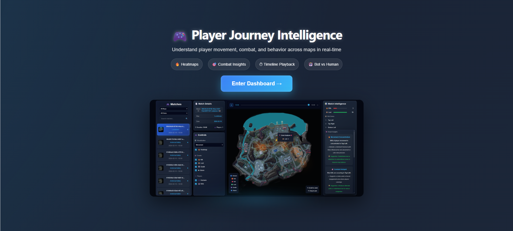
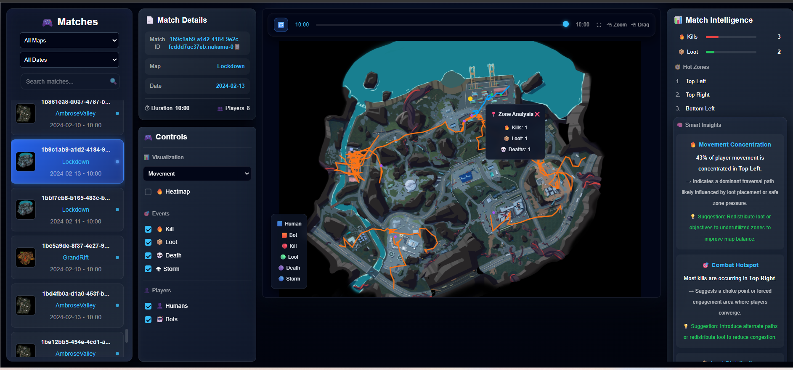
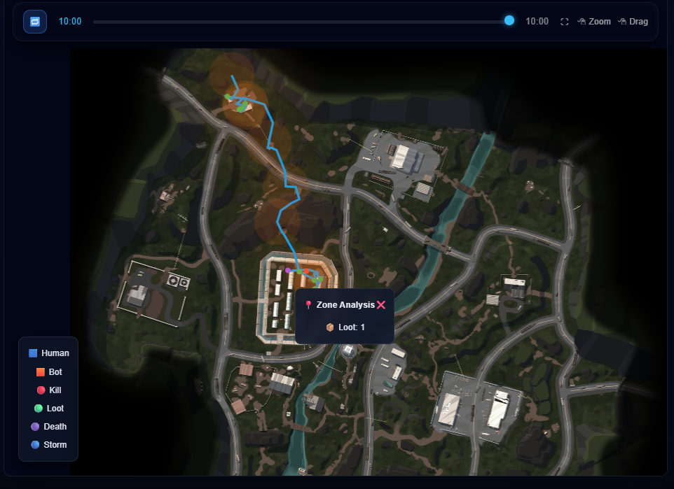
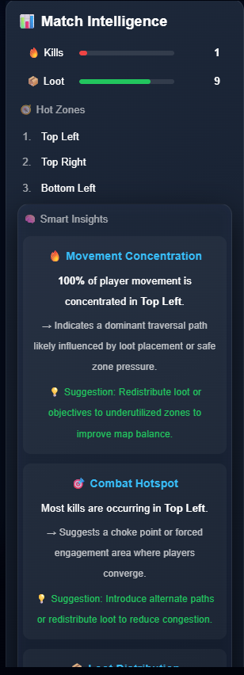

# Player Journey Intelligence
### A telemetry visualization tool for Level Designers at LILA Games

> Transform raw gameplay data into spatial, temporal, and behavioral insights — without requiring data querying or scripting.
Rendering is optimized using **layered canvas architecture and path slicing**, ensuring smooth playback even with dense telemetry data.

---

## Live Demo



    





| Surface | URL |
|---|---|
| **Dashboard** | https://lila-player-journey-tool-beta.vercel.app/ |
| **API** | https://lila-player-journey-api.onrender.com |
| **Walkthrough** | https://drive.google.com/file/d/1m9EmlIy8iVgnnMmZFe8hexeqX_ioiL8X/view?usp=sharing |

---

## What This Solves

Level Designers at LILA Games have access to raw telemetry parquet files but no fast way to answer:

- Where are players actually moving on each map?
- Where do kills cluster — and is that by design or accident?
- Which zones are being ignored entirely?
- How does a match unfold over time?

This tool converts 5 days of production gameplay data from **LILA BLACK** (extraction shooter) into an interactive browser-based dashboard — no data science skills required.

---

## Features

### Movement Visualization
Player paths rendered directly on each minimap with world-to-pixel coordinate transformation. Human and bot paths are visually distinct. Paths are sliced dynamically as the timeline progresses.

### Event Markers
Four event types rendered as overlaid markers on the map canvas:

| Event | Marker | Color |
|---|---|---|
| Kill | 🔥 | Red |
| Loot | 📦 | Green |
| Death | 💀 | Purple |
| Storm Death | 🌪 | Blue |

### Timeline Playback
A scrubber at the top of the canvas lets designers replay any match from the beginning. Auto-play and manual step-through are both supported. Event markers appear at the correct timestamp as the timeline advances.

### Heatmap Overlays
Toggle between three heatmap modes — movement density, kill hotspots, and death concentration — rendered as a canvas overlay on top of the minimap. Switchable independently of event markers.

### Match Filtering
Filter by map (Lockdown, AmbroseValley, or all), date, or specific match ID. The match list updates instantly without a page reload.

### Match Intelligence Panel
Per-match summary showing kill count, loot count, top active zones, and behavioral patterns (movement concentration, combat zone location, K/L ratio, playstyle distribution).

### Human vs Bot Distinction
The `is_bot` flag in the telemetry is used to color-code all paths and markers. Humans render in blue; bots in orange. Both are filterable independently via the Players toggle.

---

## Tech Stack

| Layer | Technology | Rationale |
|---|---|---|
| Data Processing | Python, Pandas, PyArrow | Fast parquet parsing and coordinate transformation |
| Backend | FastAPI | Lightweight, auto-documented REST API |
| Frontend | React + Vite | Component-based, fast dev loop |
| Canvas Rendering | React-Konva | GPU-accelerated canvas — handles large path sets without DOM overhead |
| Deployment | Vercel + Render | Zero-config, shareable links |

---

## Architecture Overview

```
Parquet Files (5 days)
        │
        ▼
process_data.py          ← Coordinate mapping, event normalization, bot detection
        │
        ▼
processed.json           ← Structured match payloads
        │
        ▼
FastAPI (Render)         ← /matches, /matches/{id}
        │
        ▼
React + Konva (Vercel)   ← Canvas layers: base → paths → events → heatmap
```

See [`ARCHITECTURE.md`](./ARCHITECTURE.md) for the full breakdown, including coordinate mapping math and tradeoffs.

---
## Performance Optimizations
The architecture scales efficiently with increasing data size due to preprocessing and canvas-based rendering, avoiding runtime computation bottlenecks.

To ensure smooth rendering with large telemetry datasets, the system uses:

- **Canvas-based rendering (React-Konva)** instead of DOM/SVG
- **Layered architecture**:
  - Base map layer
  - Player paths layer
  - Event markers layer
  - Heatmap layer
- **Path slicing based on timeline progress**
  - Only the visible portion of player paths is rendered
  - Reduces unnecessary draw calls
- **Preprocessed JSON**
  - Avoids expensive runtime computation

These optimizations ensure the UI remains responsive even with dense player movement data.

## Coordinate Mapping

Game telemetry uses 3D world coordinates `(x, z)`. The minimap is a 2D image. The transformation:

```python
u = (x - origin_x) / scale
v = (z - origin_z) / scale

px = u * map_width          # 1024px
py = (1 - v) * map_height   # Y-axis inverted for screen space
```

Each map has a fixed `origin` and `scale` derived from the README coordinate specification. This ensures paths overlay accurately regardless of which map is selected.

---

## Project Structure

```
lila-player-journey-tool/
├── backend/
│   ├── api/                          # Route handlers
│   ├── data/                         # Raw parquet input files
│   ├── output/
│   │   └── processed.json            # Pre-processed match data (generated)
│   ├── scripts/
│   │   └── process_data.py           # Parquet → JSON pipeline
│   ├── venv/                         # Python virtual environment (not committed)
│   └── requirements.txt
│
├── frontend/
│   └── player-journey-ui/
│       ├── public/                   # Static assets
│       ├── src/
│       │   ├── assets/
│       │   ├── components/
│       │   │   ├── ControlsPanel.jsx     # Filters, toggles, heatmap selector
│       │   │   ├── HeatmapLayer.jsx      # Canvas heatmap overlay
│       │   │   ├── InsightsPanel.jsx     # Match intelligence summary
│       │   │   ├── Legend.jsx            # Event/player type legend
│       │   │   └── MapView.jsx           # Konva canvas — paths, events, heatmap
│       │   ├── App.css
│       │   ├── App.jsx
│       │   ├── index.css
│       │   └── main.jsx
│       ├── .gitignore
│       ├── eslint.config.js
│       ├── index.html
│       ├── package.json
│       ├── package-lock.json
│       ├── README.md                 # Frontend-specific notes
│       └── vite.config.js
│
├── venv/                             # Root-level venv (not committed)
├── .gitignore
├── ARCHITECTURE.md
├── INSIGHTS.md
└── README.md
```

---

## Local Setup

### Prerequisites
- Python 3.10+
- Node.js 18+

### 1. Clone

```bash
git clone https://github.com/Shubasarkar1999/lila-player-journey-tool.git
cd lila-player-journey-tool
```

### 2. Process the Data

Run once to convert parquet files into the structured JSON the API serves:

```bash
cd backend/scripts
python process_data.py
```

Processed output is written to `backend/output/processed.json`.

### 3. Start the Backend

```bash
cd backend
python -m venv venv
source venv/bin/activate       # Windows: venv\Scripts\activate
pip install -r requirements.txt
uvicorn main:app --reload
```

API available at `http://localhost:8000`. Swagger docs at `http://localhost:8000/docs`.

### 4. Start the Frontend

```bash
cd frontend/player-journey-ui
npm install
npm run dev
```

Dashboard available at `http://localhost:5173`.

---

## Environment Variables

### Frontend

Create `frontend/player-journey-ui/.env.local`:

```env
VITE_API_BASE_URL=http://localhost:8000
```

For production, set this to your deployed backend URL in Vercel's environment settings.

### Backend

No secrets required. The API reads from `output/processed.json` which is generated locally.

---

## Deployment

### Frontend → Vercel

```bash
cd frontend/player-journey-ui
npm run build
# Deploy via Vercel CLI or connect the repo via vercel.com
```

Set `VITE_API_BASE_URL` to your backend URL in the Vercel project settings.

### Backend → Render

1. Connect the `backend/` directory as a new Web Service on Render
2. Build command: `pip install -r requirements.txt`
3. Start command: `uvicorn main:app --host 0.0.0.0 --port 10000`
4. Ensure `output/processed.json` is committed to the repo, or add a build step to generate it

---

## Key Assumptions

| Area | Assumption |
|---|---|
| Dates | Folder names (`February_10`, etc.) are treated as the canonical match date — raw timestamps were inconsistent |
| Map bounds | Origin and scale per map are hardcoded from the README specification |
| Bot detection | `is_bot` flag is trusted as provided — no secondary validation |
| Event normalization | All event type strings are lowercased and trimmed during processing |
| Coordinate axes | `x` maps to horizontal, `z` maps to vertical (Y is elevation, unused) |

---

## Data Insights

See [`INSIGHTS.md`](./INSIGHTS.md) for three specific findings from the data, including:

- Movement concentration patterns on Lockdown vs AmbroseValley
- Kill clustering around specific map structures
- Edge vs center playstyle distribution and what it implies for spawn tuning

---

## What's Not Included (and Why)

- **Real-time ingestion** — out of scope; tool is designed for post-match analysis
- **ML-based clustering** — rule-based zone detection is sufficient for this data volume and more explainable to designers
- **Session comparison** — useful next feature; not prioritized given the 5-day window

## Challenges & Tradeoffs

- Handling large telemetry → solved via preprocessing
- Avoiding DOM lag → used canvas (React-Konva)
- Timeline performance → path slicing instead of full redraw